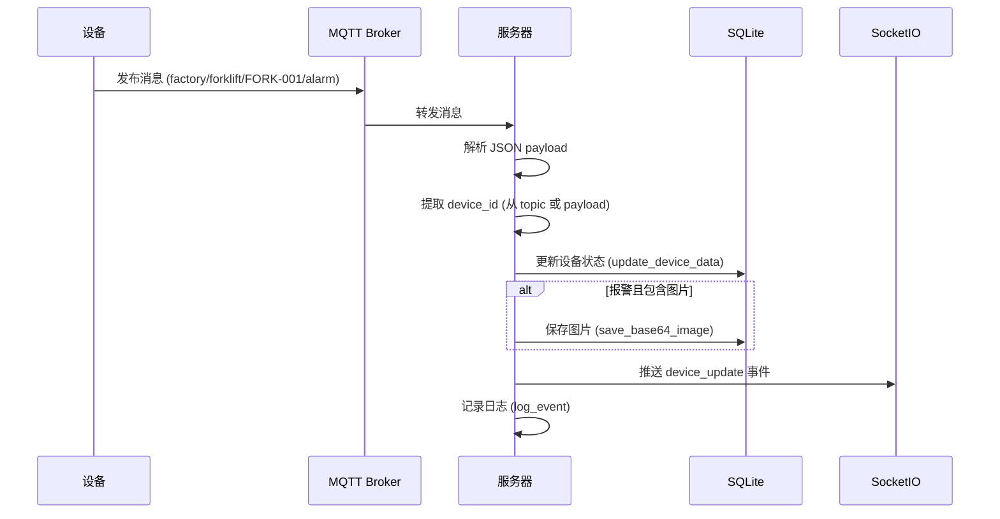
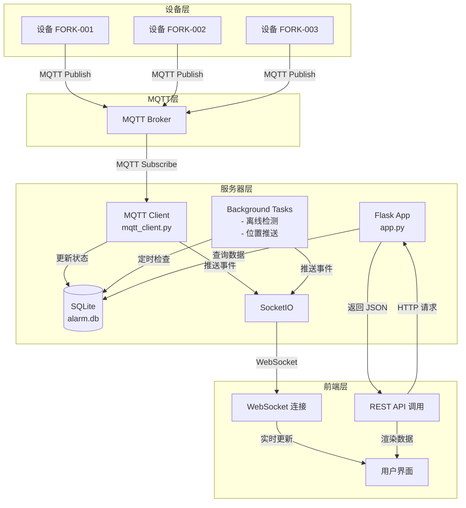
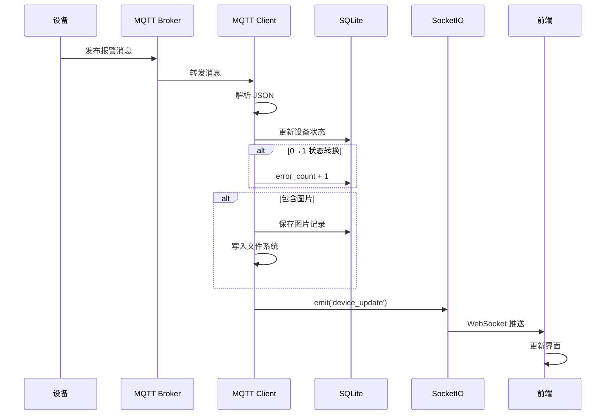
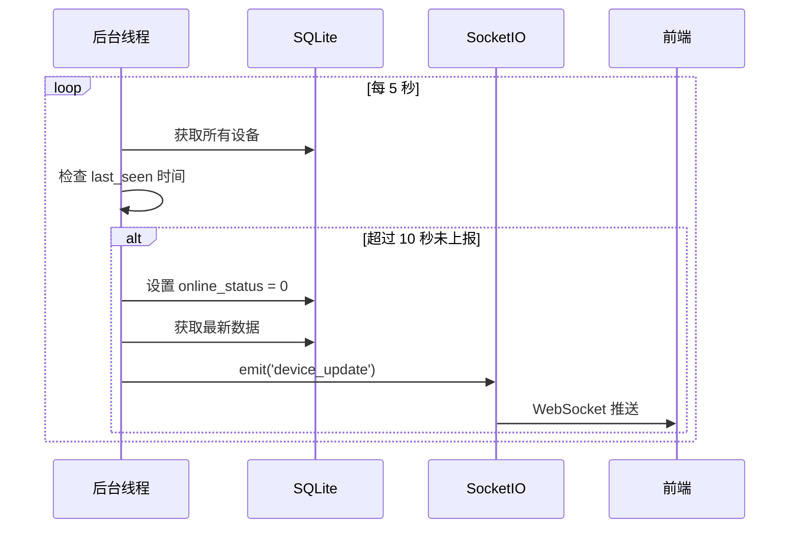

# 通信层架构文档

## 概述

叉车安全监测系统采用三层通信架构，实现设备数据采集、实时状态推送和前端交互。

```
┌─────────────┐     MQTT      ┌─────────────┐    Socket.IO    ┌─────────────┐
│   设备端    │ ────────────→ │   服务器    │ ────────────→ │   前端      │
│ (Forklift)  │               │  (Flask)    │               │  (Browser)  │
└─────────────┘               └─────────────┘               └─────────────┘
                                    ↑
                                    │ REST API
                                    │
                              ┌─────┴─────┐
                              │  前端请求  │
                              └───────────┘
```

---

## 1. MQTT 通信层（设备 → 服务器）

### 1.1 连接配置

| 配置项 | 默认值 | 说明 |
|--------|--------|------|
| `MQTT_BROKER` | `localhost` | MQTT 代理地址 |
| `MQTT_PORT` | `1883` | MQTT 代理端口 |
| `MQTT_TOPIC` | `factory/forklift/+/alarm` | 订阅主题（通配符 `+` 匹配设备ID） |

### 1.2 主题命名规范

```
factory/forklift/{device_id}/alarm
```

- `factory`：工厂标识（固定）
- `forklift`：设备类型（固定）
- `{device_id}`：设备唯一标识（如 `FORK-001`）
- `alarm`：消息类型（固定）

### 1.3 消息格式

#### 标准消息
```json
{
  "device_id": "FORK-001",
  "alarm": 1,
  "timestamp": "2026-03-19 14:30:00"
}
```

| 字段 | 类型 | 必填 | 说明 |
|------|------|------|------|
| `device_id` | string | 是 | 设备唯一标识 |
| `alarm` | integer | 是 | 报警状态：0=正常，1=报警 |
| `timestamp` | string | 是 | 设备上报时间（格式：`YYYY-MM-DD HH:mm:ss`） |

#### 扩展消息（含图片）
```json
{
  "device_id": "FORK-001",
  "alarm": 1,
  "timestamp": "2026-03-19 14:30:00",
  "image": "data:image/jpeg;base64,/9j/4AAQSkZJRg..."
}
```

| 字段 | 类型 | 必填 | 说明 |
|------|------|------|------|
| `image` | string | 否 | Base64 编码的报警图片（支持 `data:image/...;base64,` 格式） |

#### 可选扩展字段
```json
{
  "device_id": "FORK-001",
  "alarm": 1,
  "timestamp": "2026-03-19 14:30:00",
  "driver_present": 1,
  "outer_intrusion": 0
}
```

| 字段 | 类型 | 说明 |
|------|------|------|
| `driver_present` | integer | 驾驶员在位状态：0=不在，1=在位 |
| `outer_intrusion` | integer | 外部入侵状态：0=无，1=有 |

### 1.4 消息处理流程



### 1.5 关键代码位置

- **MQTT 客户端初始化**：[`mqtt_client.py:59-74`](mqtt_client.py:59)
- **消息回调处理**：[`mqtt_client.py:28-57`](mqtt_client.py:28)
- **设备ID提取逻辑**：[`mqtt_client.py:34-35`](mqtt_client.py:34)
- **图片保存逻辑**：[`mqtt_client.py:43-46`](mqtt_client.py:43)

---

## 2. HTTP/REST API 通信层（前端 → 服务器）

### 2.1 鉴权方式

#### 请求头方式
```http
Authorization: Bearer <token>
```
或
```http
X-Auth-Token: <token>
```

#### 鉴权逻辑
- 如果 `AUTH_ENABLED = False`，跳过鉴权（开发模式）
- 如果 `AUTH_ENABLED = True`，必须提供有效 token

### 2.2 API 端点列表

#### 设备状态相关

| 方法 | 路径 | 说明 | 鉴权 |
|------|------|------|------|
| GET | `/api/latest` | 获取所有设备最新状态和统计 | 是 |
| GET | `/api/devices` | 获取所有设备位置和状态（Dashboard用） | 是 |
| GET | `/device/<device_id>/history` | 获取设备历史记录和趋势 | 是 |

#### 报警图片相关

| 方法 | 路径 | 说明 | 鉴权 |
|------|------|------|------|
| GET | `/api/device/<device_id>/images` | 获取设备报警图片列表 | 是 |
| GET | `/api/device/<device_id>/latest-image` | 获取设备最新报警图片 | 是 |
| GET | `/images/<filename>` | 获取图片文件 | 否 |

#### 日志相关

| 方法 | 路径 | 说明 | 鉴权 |
|------|------|------|------|
| GET | `/api/logs` | 分页查询日志（支持筛选） | 是 |
| GET | `/api/biz_logs` | 兼容旧接口（仅业务日志） | 是 |

#### Dashboard 相关

| 方法 | 路径 | 说明 | 鉴权 |
|------|------|------|------|
| GET | `/api/recent-alarms` | 获取最近报警事件 | 是 |
| GET | `/Dashboard.png` | 获取工厂地图图片 | 否 |

### 2.3 请求/响应示例

#### GET /api/latest

**请求**
```http
GET /api/latest HTTP/1.1
Authorization: Bearer <token>
```

**响应**
```json
{
  "devices": [
    {
      "device_id": "FORK-001",
      "alarm_status": 1,
      "error_count": 5,
      "boot_time": "2026-03-19 10:00:00",
      "last_seen": "2026-03-19 14:30:00",
      "online_status": 1,
      "update_time": "2026-03-19 14:30:00",
      "pos_x": 100.5,
      "pos_y": 200.3
    }
  ],
  "stats": {
    "total": 3,
    "online": 2,
    "alarm": 1
  }
}
```

#### GET /api/logs

**请求**
```http
GET /api/logs?page=1&page_size=20&level=ERROR&device_id=FORK-001 HTTP/1.1
Authorization: Bearer <token>
```

**查询参数**

| 参数 | 类型 | 必填 | 说明 |
|------|------|------|------|
| `page` | integer | 否 | 页码（默认：1） |
| `page_size` | integer | 否 | 每页条数（默认：20） |
| `level` | string | 否 | 日志级别筛选（DEBUG/INFO/WARNING/ERROR/CRITICAL） |
| `device_id` | string | 否 | 设备ID筛选 |
| `category` | string | 否 | 分类筛选（ops/biz/sec） |

**响应**
```json
{
  "logs": [
    {
      "id": 1,
      "ts": "2026-03-19T14:30:00Z",
      "level": "ERROR",
      "event": "mqtt.message.parse_failed",
      "category": "ops",
      "device_id": "FORK-001",
      "message": "Failed to process MQTT message",
      "extra": {"error": "JSON decode error"}
    }
  ],
  "total": 100,
  "total_pages": 5
}
```

#### GET /device/<device_id>/history

**请求**
```http
GET /device/FORK-001/history HTTP/1.1
Authorization: Bearer <token>
```

**响应**
```json
{
  "device_id": "FORK-001",
  "labels": ["14:00", "14:01", "14:02"],
  "counts": [2, 1, 3],
  "raw_history": [
    {
      "alarm": 1,
      "timestamp": "2026-03-19 14:02:30"
    }
  ]
}
```

### 2.4 关键代码位置

- **鉴权入口**：[`app.py:46-52`](app.py:46)
- **Token 提取**：[`app.py:30-35`](app.py:30)
- **Token 验证**：[`app.py:37-44`](app.py:37)
- **API 端点定义**：[`app.py:163-290`](app.py:163)

---

## 3. 数据流图

### 3.1 完整数据流



### 3.2 报警处理流程



### 3.3 离线检测流程



---

## 4. 扩展点

### 4.1 新增消息类型

1. 在 `mqtt_client.py` 的 `on_message` 函数中添加处理逻辑
2. 在 `db.py` 中添加相应的数据库操作
3. 在 `app.py` 中添加新的 API 端点（如需要）

### 4.2 新增设备类型

1. 修改 MQTT 主题模式（如 `factory/{device_type}/+/alarm`）
2. 在 `config.py` 中添加新的配置项
3. 在 `db.py` 中扩展设备表结构

### 4.3 新增 API 端点

1. 在 `app.py` 中添加新的路由函数
2. 使用 `require_auth()` 进行鉴权（如需要）
3. 在 `db.py` 中添加相应的数据库查询函数
