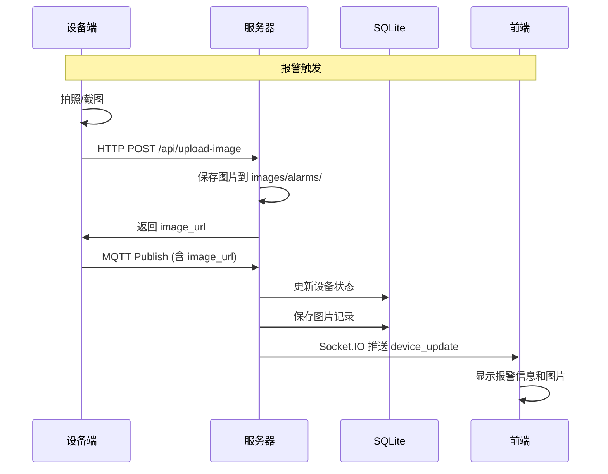

# 叉车端图片上传功能接入指南

## 概述

本文档说明叉车设备端如何接入图片上传功能。系统采用 **MQTT + HTTP 混合方式** 实现报警图片的传输，兼顾实时性和可靠性。

---

## 架构设计

```
┌─────────────┐     HTTP POST      ┌─────────────┐
│   设备端    │ ──────────────────→ │   服务器    │
│ (Forklift)  │                    │  (Flask)    │
└─────────────┘                    └─────────────┘
       │                                  │
       │ MQTT Publish                     │ 保存图片
       │ (含 image_url)                   ↓
       └──────────────────────────→ images/alarms/
```

### 为什么采用混合方式？

| 方式 | 优点 | 缺点 |
|------|------|------|
| 纯 MQTT (Base64) | 实现简单，单次通信 | 消息体积大，影响实时性 |
| 纯 HTTP | 可靠性高 | 需要额外建立连接，延迟高 |
| **MQTT + HTTP 混合** | 兼顾实时性和可靠性 | 实现稍复杂 |

---

## 接入流程

### 步骤 1：设备端上传图片

**请求**

```http
POST /api/upload-image HTTP/1.1
Content-Type: multipart/form-data
Host: <server_ip>:5000

--boundary
Content-Disposition: form-data; name="image"; filename="alarm_20260319_143000.jpg"
Content-Type: image/jpeg

<二进制图片数据>
--boundary--
```

**响应**

```json
{
  "success": true,
  "image_url": "/images/alarms/FORK-001_20260319_143000_abc123.jpg"
}
```

**错误响应**

```json
{
  "success": false,
  "error": "No image file provided"
}
```

### 步骤 2：设备端发送 MQTT 报警消息

**消息格式**

```json
{
  "device_id": "FORK-001",
  "alarm": 1,
  "timestamp": "2026-03-19 14:30:00",
  "image_url": "/images/alarms/FORK-001_20260319_143000_abc123.jpg"
}
```

**字段说明**

| 字段 | 类型 | 必填 | 说明 |
|------|------|------|------|
| `device_id` | string | 是 | 设备唯一标识 |
| `alarm` | integer | 是 | 报警状态：0=正常，1=报警 |
| `timestamp` | string | 是 | 设备上报时间（格式：`YYYY-MM-DD HH:mm:ss`） |
| `image_url` | string | 否 | 图片 URL（从步骤 1 的响应中获取） |

---

## 完整时序图



---

## 服务器端实现

### 图片上传接口

**文件位置**：[`app.py`](../app.py)

```python
@app.route('/api/upload-image', methods=['POST'])
def upload_image():
    """接收设备上传的图片，保存并返回 URL"""
    if 'image' not in request.files:
        return jsonify({'success': False, 'error': 'No image file provided'}), 400
    
    file = request.files['image']
    if file.filename == '':
        return jsonify({'success': False, 'error': 'No selected file'}), 400
    
    # 生成唯一文件名
    device_id = request.form.get('device_id', 'unknown')
    timestamp = datetime.now().strftime('%Y%m%d_%H%M%S')
    random_str = uuid.uuid4().hex[:8]
    ext = os.path.splitext(file.filename)[1] or '.jpg'
    filename = f"{device_id}_{timestamp}_{random_str}{ext}"
    
    # 保存文件
    filepath = os.path.join(IMAGE_DIR, filename)
    file.save(filepath)
    
    # 返回 URL
    image_url = f"/images/alarms/{filename}"
    return jsonify({'success': True, 'image_url': image_url})
```

### MQTT 消息处理

**文件位置**：[`mqtt_client.py`](../mqtt_client.py)

```python
def on_message(client, userdata, msg):
    """处理 MQTT 消息"""
    try:
        payload = json.loads(msg.payload.decode())
        device_id = payload.get('device_id')
        alarm = payload.get('alarm')
        timestamp = payload.get('timestamp')
        image_url = payload.get('image_url')  # 新增字段
        
        # 更新设备状态
        update_device_data(device_id, alarm, timestamp, image_url)
        
        # 推送更新
        socketio.emit('device_update', get_device_status(device_id))
        
    except Exception as e:
        log_event('ERROR', 'mqtt.message.parse_failed', str(e))
```

### 数据库存储

**图片记录表**：`device_images`

| 字段 | 类型 | 说明 |
|------|------|------|
| `id` | INTEGER | 主键 |
| `device_id` | TEXT | 设备 ID |
| `image_url` | TEXT | 图片 URL |
| `created_at` | TEXT | 创建时间 |

---

## 设备端实现示例

### Python 示例

```python
import requests
import paho.mqtt.client as mqtt
import json
from datetime import datetime

# 配置
SERVER_URL = "http://localhost:5000"
MQTT_BROKER = "localhost"
MQTT_PORT = 1883
DEVICE_ID = "FORK-001"

def upload_image(image_path):
    """上传图片并返回 URL"""
    with open(image_path, 'rb') as f:
        files = {'image': f}
        data = {'device_id': DEVICE_ID}
        response = requests.post(f"{SERVER_URL}/api/upload-image", files=files, data=data)
    
    if response.status_code == 200:
        result = response.json()
        if result.get('success'):
            return result.get('image_url')
    return None

def send_alarm(alarm_status, image_url=None):
    """发送报警消息"""
    client = mqtt.Client()
    client.connect(MQTT_BROKER, MQTT_PORT, 60)
    
    message = {
        'device_id': DEVICE_ID,
        'alarm': alarm_status,
        'timestamp': datetime.now().strftime('%Y-%m-%d %H:%M:%S')
    }
    
    if image_url:
        message['image_url'] = image_url
    
    topic = f"factory/forklift/{DEVICE_ID}/alarm"
    client.publish(topic, json.dumps(message))
    client.disconnect()

# 使用示例
if __name__ == '__main__':
    # 1. 上传图片
    image_url = upload_image('alarm_snapshot.jpg')
    
    # 2. 发送报警
    if image_url:
        send_alarm(1, image_url)
    else:
        send_alarm(1)  # 无图片报警
```

### C/C++ 示例（嵌入式设备）

```c
#include <stdio.h>
#include <stdlib.h>
#include <string.h>
#include <curl/curl.h>
#include <MQTTClient.h>

#define SERVER_URL "http://localhost:5000"
#define MQTT_BROKER "tcp://localhost:1883"
#define DEVICE_ID "FORK-001"

char* upload_image(const char* image_path) {
    CURL *curl;
    CURLcode res;
    char *image_url = NULL;
    
    curl_global_init(CURL_GLOBAL_DEFAULT);
    curl = curl_easy_init();
    
    if(curl) {
        curl_mime *mime = curl_mime_init(curl);
        curl_mimepart *part = curl_mime_addpart(mime);
        
        curl_mime_name(part, "image");
        curl_mime_filedata(part, image_path);
        
        char url[256];
        snprintf(url, sizeof(url), "%s/api/upload-image", SERVER_URL);
        
        curl_easy_setopt(curl, CURLOPT_URL, url);
        curl_easy_setopt(curl, CURLOPT_MIMEPOST, mime);
        
        // 简化示例，实际需要处理响应
        res = curl_easy_perform(curl);
        
        curl_mime_free(mime);
        curl_easy_cleanup(curl);
    }
    
    curl_global_cleanup();
    return image_url;
}

void send_alarm(int alarm_status, const char* image_url) {
    MQTTClient client;
    MQTTClient_connectOptions conn_opts = MQTTClient_connectOptions_initializer;
    
    MQTTClient_create(&client, MQTT_BROKER, DEVICE_ID, MQTTCLIENT_PERSISTENCE_NONE, NULL);
    conn_opts.keepAliveInterval = 20;
    conn_opts.cleansession = 1;
    
    MQTTClient_connect(client, &conn_opts);
    
    char payload[512];
    if (image_url) {
        snprintf(payload, sizeof(payload),
            "{\"device_id\":\"%s\",\"alarm\":%d,\"timestamp\":\"%s\",\"image_url\":\"%s\"}",
            DEVICE_ID, alarm_status, "2026-03-19 14:30:00", image_url);
    } else {
        snprintf(payload, sizeof(payload),
            "{\"device_id\":\"%s\",\"alarm\":%d,\"timestamp\":\"%s\"}",
            DEVICE_ID, alarm_status, "2026-03-19 14:30:00");
    }
    
    char topic[128];
    snprintf(topic, sizeof(topic), "factory/forklift/%s/alarm", DEVICE_ID);
    
    MQTTClient_message pubmsg = MQTTClient_message_initializer;
    pubmsg.payload = payload;
    pubmsg.payloadlen = strlen(payload);
    pubmsg.qos = 1;
    pubmsg.retained = 0;
    
    MQTTClient_publishMessage(client, topic, &pubmsg, NULL);
    MQTTClient_disconnect(client, 10000);
    MQTTClient_destroy(&client);
}
```

---

## 配置说明

### 服务器配置

**文件位置**：[`config.py`](../config.py)

```python
# 图片存储目录
IMAGE_DIR = "images/alarms"

# 图片大小限制（字节）
MAX_IMAGE_SIZE = 10 * 1024 * 1024  # 10MB

# 允许的图片格式
ALLOWED_EXTENSIONS = {'.jpg', '.jpeg', '.png', '.gif', '.bmp'}
```

### 设备端配置

| 配置项 | 说明 | 示例值 |
|--------|------|--------|
| `SERVER_URL` | 服务器地址 | `http://192.168.1.100:5000` |
| `MQTT_BROKER` | MQTT 代理地址 | `192.168.1.100` |
| `MQTT_PORT` | MQTT 代理端口 | `1883` |
| `DEVICE_ID` | 设备唯一标识 | `FORK-001` |
| `IMAGE_QUALITY` | 图片质量（0-100） | `80` |
| `IMAGE_MAX_SIZE` | 图片最大尺寸 | `1920x1080` |

---

## 常见问题

### Q1: 图片上传失败怎么办？

**可能原因**：
1. 网络连接问题
2. 图片格式不支持
3. 图片大小超过限制
4. 服务器存储空间不足

**解决方案**：
1. 检查网络连接
2. 确保图片格式为 JPG/PNG/GIF/BMP
3. 压缩图片或降低分辨率
4. 清理服务器存储空间

### Q2: MQTT 消息中没有 image_url 字段？

**可能原因**：
1. 图片上传失败
2. 设备端代码逻辑错误

**解决方案**：
1. 检查图片上传接口返回值
2. 确保在上传成功后才发送 MQTT 消息
3. 添加错误处理逻辑

### Q3: 前端无法显示图片？

**可能原因**：
1. 图片 URL 不正确
2. 图片文件不存在
3. 图片路径权限问题

**解决方案**：
1. 检查图片 URL 是否可访问
2. 确认图片文件存在于 `images/alarms/` 目录
3. 检查文件权限设置

---

## 性能优化建议

### 1. 图片压缩

```python
from PIL import Image

def compress_image(image_path, quality=80, max_size=(1920, 1080)):
    """压缩图片"""
    img = Image.open(image_path)
    img.thumbnail(max_size, Image.Resampling.LANCZOS)
    img.save(image_path, quality=quality, optimize=True)
```

### 2. 批量上传

对于网络不稳定的场景，可以实现批量上传：

```python
def batch_upload(image_paths):
    """批量上传图片"""
    urls = []
    for path in image_paths:
        url = upload_image(path)
        if url:
            urls.append(url)
    return urls
```

### 3. 断点续传

对于大文件，可以实现断点续传：

```python
def upload_image_chunked(image_path, chunk_size=1024*1024):
    """分块上传图片"""
    # 实现分块上传逻辑
    pass
```

---

## 相关文档

- [通信层架构文档](communication-layer.md)
- [日志规范文档](logging-spec.md)
- [UI 设计指南](ui-design-guide.md)

---

## 更新日志

| 版本 | 日期 | 说明 |
|------|------|------|
| 1.0 | 2026-03-20 | 初始版本，支持 MQTT+HTTP 混合图片上传 |
